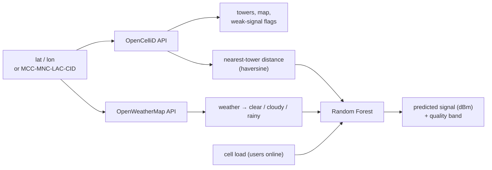

# Network Optimizer — Cellular Signal Prediction

[](https://github.com/SASHI117/Network-Optimizer/actions/workflows/ci.yml)


A Streamlit app that estimates **mobile signal strength at a location**. It
combines live cell-tower data from [OpenCelliD](https://opencellid.org),
live weather from [OpenWeatherMap](https://openweathermap.org/api), and a
**Random Forest** regression model.

```bash
pip install -r requirements.txt
streamlit run app.py
```

The Signal Model page works immediately. The live pages need free API keys:
type them into the sidebar, or set `OPENCELLID_API_KEY` / `OPENWEATHER_API_KEY`
as environment variables or in `.streamlit/secrets.toml`.

## How it works



| Page | What it does |
|---|---|
| **Network & Weather** | Nearby towers on a map with weak-signal (< −90 dBm) flags, current weather, and the **predicted signal at your coordinates** |
| **Signal Model** | Training and evaluation, a comparison with a physics baseline, feature importance, what-if sliders, and **retraining on your own CSV** |

## The model

The Random Forest is trained on data from a **physics-based signal simulator** built on the
standard log-distance propagation model with log-normal shadowing, so it runs out of the box
with no data collection:

```
RSSI(d) = P0 − 10·n·log10(d / d0) − weather_loss − 0.08·users + X,  X ~ N(0, 6 dB)
P0 = −50 dBm at d0 = 50 m,  n = 3.2 (urban),  weather_loss ∈ {0, 0.5, 2.5} dB
```

X is the random shadowing loss from buildings and terrain. Its 6 dB spread is the theoretical
floor for prediction error on this data.

| Held-out 20% (3,000 samples) | RMSE | MAE | R² |
|---|---|---|---|
| **Random Forest (300 trees)** | **6.29 dB** | **5.09 dB** | **0.80** |
| Theoretical noise floor | 6.0 dB | | |

- The model's error is **within 5% of the theoretical floor**, so it has captured essentially all
  the learnable structure.
- **Distance carries 91% of the feature importance**, in line with path-loss physics.
- Latency is deliberately **not** an input: it is a consequence of signal quality, so using it
  would leak the target.
- Drop in real drive-test measurements (`distance_km, users_online, weather, signal_strength`) on
  the Signal Model page, and the forest retrains on them instantly.

## OpenCelliD notes

- The area search (`/cell/search`) often returns nothing for India. There,
  look up one cell by **MCC / MNC / LAC / Cell ID**, which Android
  field-test and network-info apps show. The fetcher tries the JSON API
  first and falls back to CSV.
- API failures and timeouts return an empty result rather than crashing
  the page.

## Tests

```bash
pip install pytest && pytest -q    # 19 tests
```

The tests cover the simulator physics, input validation, that the model
reaches the noise floor with distance dominating, the weather mapping,
haversine distance, and OpenCelliD JSON/CSV parsing with mocked HTTP. They
also render **every page headlessly with Streamlit's AppTest**. CI runs them
on each push.

## Project layout

```
app.py                      page router
sections/landingpage.py     overview
sections/network.py         towers + weather + live prediction
sections/signal_model_page.py  training, evaluation, what-if, CSV retraining
utils/api_fetchers.py       OpenCelliD / OpenWeatherMap clients
utils/signal_model.py       simulator, Random Forest, baseline, helpers
```

## Roadmap

- Sector- and band-aware features (antenna azimuth, frequency band) from OpenCelliD.
- Crowdsourced drive-test logging from an Android companion app.
- Per-operator comparisons on the map.
