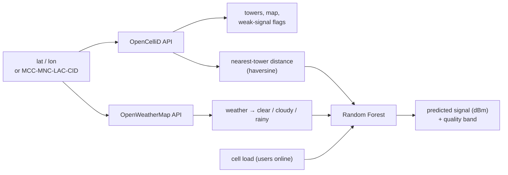

# Network Optimizer — Cellular Signal Prediction

[](https://github.com/SASHI117/Network-Optimizer/actions/workflows/ci.yml)


A Streamlit app that estimates **mobile signal strength at a location**. It
combines live cell-tower data from [OpenCelliD](https://opencellid.org),
live weather from [OpenWeatherMap](https://openweathermap.org/api), and a
**Random Forest** regression model.

```bash
pip install -r requirements.txt
streamlit run app.py
```

The Signal Model page works immediately. The live pages need free API keys:
type them into the sidebar, or set `OPENCELLID_API_KEY` / `OPENWEATHER_API_KEY`
as environment variables or in `.streamlit/secrets.toml`.

## How it works



| Page | What it does |
|---|---|
| **Network & Weather** | Nearby towers on a map with weak-signal (< −90 dBm) flags, current weather, and the **predicted signal at your coordinates** |
| **Signal Model** | Training and evaluation, a comparison with a physics baseline, feature importance, what-if sliders, and **retraining on your own CSV** |

## The model, and the data it is trained on

No labelled drive-test measurements were collected for this project. The
default training data therefore comes from a **simulator** built on the
standard propagation model:

```
RSSI(d) = P0 − 10·n·log10(d / d0) − weather_loss − 0.08·users + X,  X ~ N(0, 6 dB)
P0 = −50 dBm at d0 = 50 m,  n = 3.2 (urban),  weather_loss ∈ {0, 0.5, 2.5} dB
```

X is **log-normal shadowing**: the random loss from buildings and terrain
that no model can predict from these inputs. At sub-6 GHz, rain attenuates
the signal very little. The weather terms are small, deliberate assumptions
(wet foliage and surfaces), not a claim about the physics.

Results on a held-out 20% (3,000 simulated measurements):

| Model | RMSE | MAE | R² |
|---|---|---|---|
| Random Forest (300 trees) | 6.29 dB | 5.09 dB | 0.802 |
| Log-distance linear baseline | **6.00 dB** | **4.83 dB** | **0.820** |
| *Irreducible shadowing noise* | *6.0 dB* | | |

**What this shows:** both models reach the noise floor, so neither can do
better on this data. The physics baseline is marginally ahead because the
simulator uses exactly its functional form. Distance accounts for 91% of
the forest's feature importance, which matches path-loss physics. The
forest earns its place on **real measurements**, where propagation doesn't
follow a clean log-distance curve. Uploading a CSV with columns
`distance_km, users_online, weather, signal_strength` retrains it on those.

An earlier prototype used *latency* as an input. That was dropped: latency
is a consequence of poor signal, not a cause, so using it to predict signal
leaks the answer.

## OpenCelliD notes

- The area search (`/cell/search`) often returns nothing for India. There,
  look up one cell by **MCC / MNC / LAC / Cell ID**, which Android
  field-test and network-info apps show. The fetcher tries the JSON API
  first and falls back to CSV.
- API failures and timeouts return an empty result rather than crashing
  the page.

## Tests

```bash
pip install pytest && pytest -q    # 19 tests
```

The tests cover the simulator physics, input validation, that both models
reach the noise floor with distance dominating, the weather mapping,
haversine distance, and OpenCelliD JSON/CSV parsing with mocked HTTP. They
also render **every page headlessly with Streamlit's AppTest**. CI runs them
on each push.

## Project layout

```
app.py                      page router
sections/landingpage.py     overview
sections/network.py         towers + weather + live prediction
sections/signal_model_page.py  training, evaluation, what-if, CSV retraining
utils/api_fetchers.py       OpenCelliD / OpenWeatherMap clients
utils/signal_model.py       simulator, Random Forest, baseline, helpers
```

## Limitations

- The default model has learned the simulator, not a real network. Treat its
  numbers as illustrative until it is retrained on measurements.
- Signal from a single nearest tower ignores sector direction, antenna
  height, band and indoor loss.
- "Users online" is an assumed input, because operators don't publish cell load.
